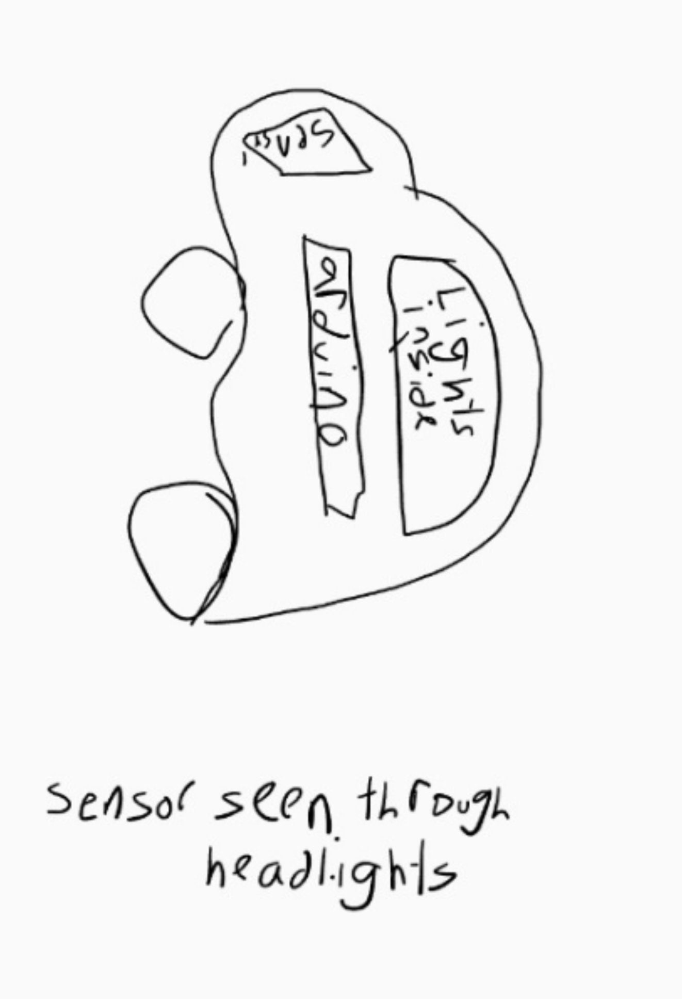
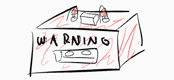
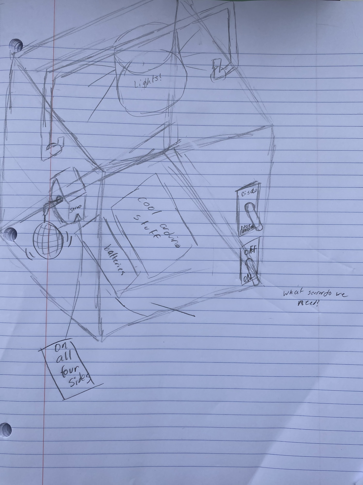
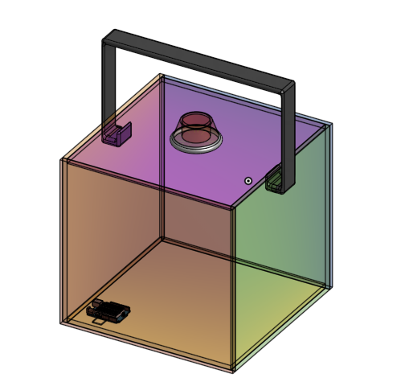

# Ultrasonic_Robot_Project

## Table of Contents
* [Planning](#Planning)
* [Changes/Evolution](#Changes/Evolution)

## Planning

This robot adresses social distancing measures with COVID-19. The preliminary idea is that is makes noise when someone comes within 2 metres of it to warn them of the proximity. Plus, a couple fun extras ;). 

### Schedule
*Basic timeline:*

Design:
* Preliminary design (like sketches and such): one week (Jan 22)
* Code (Lucy): four weeks (Feb 19)
* OnShape (Josie): four weeks (Feb 19)

Meet dates:
* In person: Tuesday
* Via zoom: BKT

Assembly: 
* Wiring: one week (Feb 26)
* Assembly of actual thing: four weeks (Mar 19)

[Link to preplanning doc](https://docs.google.com/document/d/1EUVMNag3KWIHk-9UFC24PIQXCwUg9NNP5cyAnD_6Xhc/edit?usp=sharing)

### Original Ideas
 

### Final Sketch

## Changes/Evolution

### Model OnShape

### Changes to basic plan/decisions
* Use a LiDAR sensor for distance sensor
* MP3/audio player of some kind for sound effects
* Box should have a handle
* Disco balls for disco mode
* *Anything I missed?*

### Important Links
[OnShape](https://cvilleschools.onshape.com/documents/e41aa58825c3f69075703e43/w/6eded204a6c70e88d15d84a6/e/10f33f92dbe2226878aa933b)
[Code](https://create.arduino.cc/editor/lgray52/ab9d6be7-250d-41d2-9c5f-ef9b109d3b19/preview)
